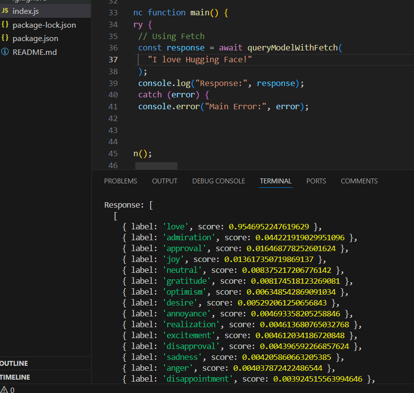

Exo1:
```
Response: [
  [
    { label: 'neutral', score: 0.5423543453216553 },
    { label: 'approval', score: 0.16130122542381287 },
    { label: 'admiration', score: 0.07578934729099274 },
    { label: 'realization', score: 0.06993197649717331 },
    { label: 'excitement', score: 0.021326962858438492 },
    { label: 'pride', score: 0.013174434192478657 },
    { label: 'joy', score: 0.01104676816612482 },
    { label: 'surprise', score: 0.010122120380401611 },
    { label: 'annoyance', score: 0.007257677614688873 },
    { label: 'disappointment', score: 0.006280812434852123 },
    { label: 'optimism', score: 0.006189434789121151 },
    { label: 'relief', score: 0.0053746048361063 },
    { label: 'disapproval', score: 0.003607328748330474 },
    { label: 'desire', score: 0.0024685983080416918 },
    { label: 'amusement', score: 0.002271316945552826 },
    { label: 'fear', score: 0.002266978146508336 },
    { label: 'disgust', score: 0.002053865697234869 },
    { label: 'embarrassment', score: 0.001961073372513056 },
    { label: 'sadness', score: 0.0016555096954107285 },
    { label: 'gratitude', score: 0.0014905274147167802 },
    { label: 'nervousness', score: 0.0013128933496773243 },
    { label: 'confusion', score: 0.0012378402752801776 },
    { label: 'curiosity', score: 0.0009786413284018636 },
    { label: 'caring', score: 0.0009030092041939497 },
    { label: 'love', score: 0.0008157825795933604 },
    { label: 'grief', score: 0.0008098450489342213 },
    { label: 'anger', score: 0.0008069336181506515 },
    { label: 'remorse', score: 0.0003833389491774142 }
  ]
]
```

